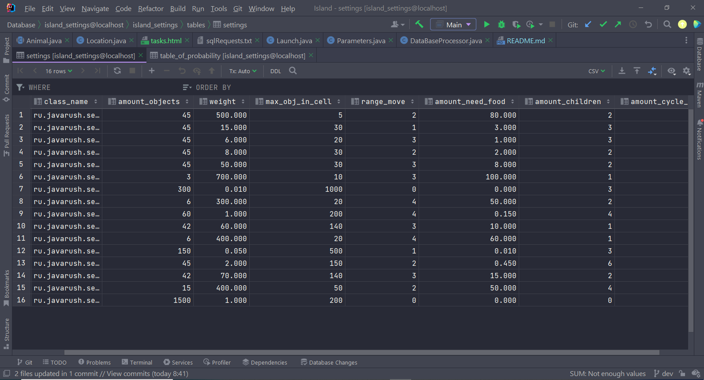

# Study project "Island"

Tasks for this project you can see: [here](src/main/resources/tasks.html).

#### In this project used follow technologies:

* Java core
* Maven
* Log4j
* Junit
* MySQL
* GitHub
* HTML
* MarkDown

This program is console application.  

Settings(data for initialisation) storages in the local database. 
Database MySQL used for targets of study, upgrade skills.

**Inside, the database consists of two tables with settings:**




In time launch application settings is assigning to fields.
User can change any settings from console API and affect to runtime app.


Island represents class, what include two - dimensional array of locations.
All animals and plants are objects, what inheritance from abstracted classes
and implements interfaces.

After initialisation of settings from database, animals and plants randomly 
allocate to different locations.
All animals and plants storage inside these locations.
Each animal is performs all actions in its own separate thread, asynchronously.
Also this program use thread pool for restore amount plants in cycles.

**Result running threads for animals are reflecting in the log:**


**Each animal has four behaviors:**
* to eat

>This behavior assumes random search animals and plants from its own ration in current location.
>If animal found food (object another animal), is calculating 
>random probability: will be eaten the animal or no. A probably eating plants 
>is 100 percent if present.
>Eating means increase satiety animal, object another animal(plant)
>is removing from location.

* to multiply;

>Each animal, if it hasn't multiplied in current cycle, is finding 
>a pair - another animal one type represent inside  its location. 
>And if it is another gender, is calculating random value - amount 
>children within set value for this animal. And new animals add to 
>current location, if don't exceeded limit of amount this type.  

* to change locations;

>In the end each cycle animals can to change whose locations.
>In this stage happens calculation indexes new location for each
>animal. Animal can move: up, down, left, right regarding its location,
>but can  to stay inside it's location.
>Animals move to new location, if limit storage animals it's type in the location is not exceed.

* to die.

>Animal can to die(to be removed from storage), if it's amount of cycles life 
>or satiety will be zero. Also another animal can to eat it's.

The specified behavior is described in the Animal class - [by reference](src/main/java/ru/javarush/sergeyivanov/island/content_of_island/fauna/Animal.java).

After request from user, statistic can to reflect to the console. 
It may by data about: ration of animals, settings, results of launches cycles, 
numbers animals:  


### Project launch:
```
$ java -jar ./Build/javarush-.jar
```

#### Limitations:
Amount animals can be from .

Main logic formed at the:
+ 


##### An example of using application:


  